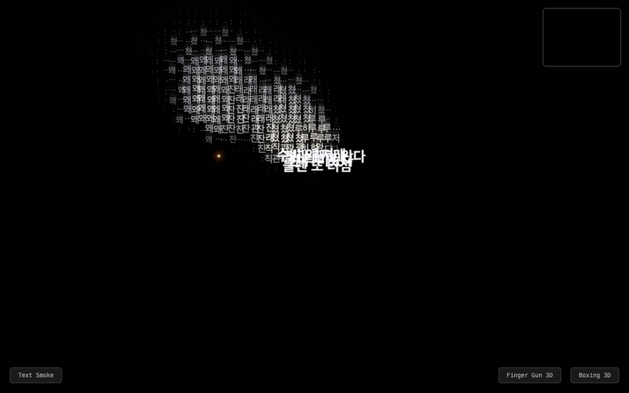

<div align="center">

# 🚬 Damta — 담타

### Exhale your work stress as smoke. With nothing but your webcam.

**Damta** (담타, Korean office slang for *"smoke break"*) turns your webcam into an interactive canvas.
Mime taking a drag from a cigarette and **breathe out real-time smoke** — or **text** — across a full-screen black canvas. No cigarette required. No install. Just your face, your hand, and a browser.

[**▶ Try it live — damta.vercel.app**](https://damta.vercel.app)

<!-- TODO: drop a demo GIF here. A 5–8s loop of exhaling text-smoke sells this in one glance.
      -->


</div>

---

## What is this?

Every desk worker knows the ritual: step out, take a breath, exhale the stress, walk back in. **Damta** captures that moment in the browser. It tracks your **hand and face** with [MediaPipe](https://developers.google.com/mediapipe), detects the cigarette-holding pose and your inhale/exhale rhythm, then renders a **particle-physics smoke plume** from your lips — that can also spell out the sigh you've been holding in.

It's a toy, an art piece, and a tidy reference for **webcam gesture detection + Canvas particle systems** in plain vanilla JS.

## Features

| Mode | What it does |
|------|--------------|
| **Text Smoke** | Your exhale rises as drifting **text** — type the sigh, then breathe it out |
| **Realistic Smoke** | Wispy, strand-based white smoke with natural turbulence and rise |
| **Artistic Smoke** | Neon swirls and color trails for the same gesture |
| **Finger Gun 3D** | Make a finger gun, "fire," watch 3D targets react |
| **Boxing / Boxing 3D** | Throw punches at a sandbag — 2D and full 3D scenes |

**Smoke physics** models three emission profiles — a thin `fingertip` wisp, a dense `exhale-burst`, and a sustained `exhale-stream` that eases back into a wisp — driven by Perlin noise for organic motion.

## Controls

**Webcam mode (default)**
- Frame your face → hold the cigarette pose → **inhale**, then **slowly exhale**
- `Space` / `M` — switch visual mode
- `C` — toggle webcam ↔ mouse mode

**Mouse mode (no webcam needed)**
- Hold **left-click** → emit smoke
- **Right-click** → move the mouth/emit point

## Run locally

No build step. Vanilla HTML + JS with CDN dependencies.

```bash
# A local server is required — file:// breaks CORS/getUserMedia
python3 -m http.server 8000
# or
npx serve .
```

Then open `http://localhost:8000`. Use **Chrome or Edge on desktop** (MediaPipe + `getUserMedia`).

## Tests

Pure logic modules are covered with Node's built-in test runner — zero npm dependencies.

```bash
node --test tests/
node --test tests/smoke-core.test.js   # single file
```

Testable UMD modules: `interaction-core.js`, `smoke-core.js`, `tracking-overlay.js`, `text-smoke.js`. Browser-only IIFE modules (`smoke.js`, `hand.js`, `face.js`, …) depend on DOM/MediaPipe.

## How it works

```
webcam frame
  → MediaPipe Hands + Face Mesh   (landmark detection)
  → pose tracker                  (cigarette pose + cigTip)
  → smoke state machine           (idle → fingertip → inhaling → exhaling → idle)
  → SmokeSystem.emit / update     (particle physics + Canvas 2D render)
  → TrackingOverlay               (hand/face wireframe)
```

- Landmarks are normalized (0–1); canvas mirrors X so it feels like a mirror.
- Face mesh runs every 3rd frame and interpolates the mouth position for performance.
- Two coexisting module patterns: **UMD** (Node-testable) and **IIFE** (browser-only). No bundler, scripts load in order from `index.html`.

## Tech stack

- **Tracking:** MediaPipe Hands + Face Mesh (CDN, version-pinned)
- **Rendering:** Canvas 2D + custom particle system
- **Motion:** Perlin/simplex noise
- **Tooling:** none — no bundler, no framework, no install
- **Deploy:** Vercel

## License

MIT — do whatever, just don't blame us for the secondhand pixels.

---

<div align="center">
<sub>Built for everyone who needs a 담타 but is trying to quit. Breathe out. ☁️</sub>
</div>
